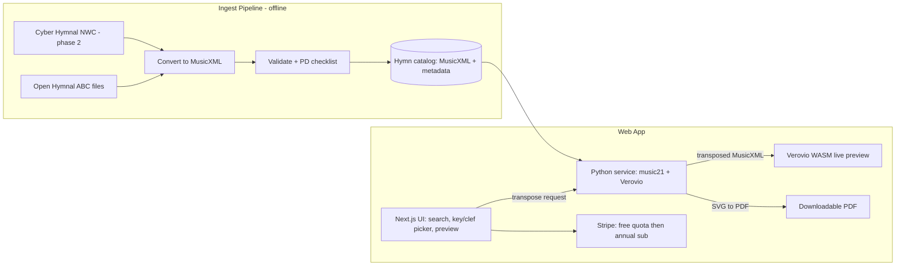

# Hymn Transposer: High-Level Plan

## Inspiration
I just spent some time looking for cheap music for particular songs in particular keys in a bass clef, and I realized that this seems to be a resource that is not easily found on the web. Here are some searches I searched for:
A thousand tongues to sing in D bass clef
A thousand tongues to sing in D sheet music bass clef
A thousand tongues to sing sheet music bass clef
hymn sheet music bass clef
amazing grace bass clef

Only the last two were successful, since they are for a very, very common song, but "O for a Thousand Tongues to Sing" is relatively common too and I suspect in the public domain.

So here's my idea. This app/website has the data for a lot of these public domain hymns or songs or scores, and you can print them off in any key that you want and in any clef. The app will automatically transpose it and render it as a PDF.

It seems like this should be technologically pretty straightforward, and we should be able to code it up. One thing I do wonder is if there is some source we can get data for the notes. If there's not a really high-quality data source that's still available, we might have to go scrape free PDFs online or other free resources and extract the music data from them.

I'm thinking we will do some kind of freemium approach where you can download your first five or ten for free, and then there will be a small monthly or annual subscription that you can subscribe to. I think I'd lean towards something annual.

It seems like there should be a wide array of free and/or public domain music out there that we can leverage.

Let's make a high-level plan with an emphasis on de-risking any unknowns.

Use sub-agents generously as you see fit for research tasks and other tasks.

## Verdict from research

All four major unknowns came back favorable:

- **Data exists, with a provenance gate**: the pinned Open Hymnal snapshot
  contains 293 structured SATB records and 275 exact public-domain-declaration
  candidates. It is sufficient for the technical pipeline, but its mutable
  unauthenticated source and record-level rights claims are not a production
  allowlist. No PDF scraping or OMR is needed for the curated MVP.
- **Tech is proven**: MusicXML is canonical; music21 selects voices,
  transposes pitches and key signatures, and changes clef representation;
  Verovio engraves SVG; and the same server pipeline creates exact Letter/A4
  PDFs. The live preview and download share that semantic pipeline.
- **Legal is a catalog workflow**: text, translation, tune, and setting require
  independent evidence and review per hymn. Re-rendering canonical notation
  avoids depending on a scan as the product's data model, but does not replace
  the underlying composition/arrangement rights review.
  - **Market gap is real but not empty**: Hymnary FlexScore ($39.99/yr) is the incumbent; we win on UX (instant preview, clean checkout) and SEO (programmatic pages per hymn/key/clef, which no one does). Target ~$24–29/yr, 5–10 free downloads, optional ~$2.99 single purchase.

## Architecture

## Phase 0 — De-risking spikes (before any product code)

**Spike A: Rendering pipeline pilot (~1–2 days).** Take 5–10 real hymns from Open Hymnal (including the gnarly cases: 4 stacked verses, SATB on two staves, refrains). Run ABC → MusicXML → music21 transpose + treble→bass clef swap → Verovio → PDF. Success = print-quality output a church musician would accept. This is the single highest-risk item (multi-verse lyric layout is the stress test for any renderer); everything else is standard web dev.

**Spike B: Data ingest pilot (~1 day).** Bulk-download the Open Hymnal ABC archive, script the conversion of all ~300 hymns to MusicXML, and measure the failure/cleanup rate. Success = >80% convert cleanly; hand-fix rate tells us the real catalog cost.

If Spike A fails on Verovio quality, fall back to a LilyPond render path (best-in-class hymnal engraving, at the cost of losing the matching live preview) before reconsidering the project.

## Phase 1 — MVP (free, no payments)

- Repo scaffold: Next.js frontend + Python (FastAPI) render service, both deployable to Vercel (container functions) or the Python service on Fly.io/Cloud Run if cold starts hurt.
- Catalog of ~50–100 best-known hymns from Open Hymnal, each with recorded PD provenance (text/tune/harmonization dates).
- Core flow: search hymn → pick key + clef (and optionally melody-only vs SATB) → live preview → download PDF.
- Programmatic SEO pages: one substantial indexable page per hymn, plus only
  demand-validated key or instrument preset URLs. Initial instrument pages are
  Amazing Grace for cello (G major, bass clef, comfortable lower octave) and
  trombone (concert B-flat major, bass clef). Other combinations remain
  shareable on-page states rather than thin indexable URLs.
- Generic SEO canaries: an indexable `/hymns` catalog targeting “hymn sheet
  music” and the existing `/uses/hymn-transposer` tool page targeting “sheet
  music transposer.” Keep the latter explicit that the first version transposes
  catalog hymns rather than arbitrary uploads.

## Phase 2 — Monetization + catalog growth

- Stripe: metered free downloads (5–10), then annual subscription (~$24–29/yr); accounts via a lightweight auth provider.
- Scale catalog using Cyber Hymnal NWC archives (NWC → MusicXML conversion, attribution note in footer) with the per-hymn PD checklist from the legal research.
- Print polish: page-size options (letter/A4), instrument presets (trombone, tuba, cello = bass clef; alto sax = Eb transposition, etc.).

## Phase 3 — Growth (later, optional)

- Long-tail: on-demand OMR (Audiveris/homr) for requested hymns not in machine-readable form.
- Parts extraction (melody-only, bass-line-only), lead sheets with chord symbols, transposing-instrument presets.

## Key risks and mitigations

- **Engraving quality of multi-verse hymns (highest risk)**: mitigated by Spike A before any other work; LilyPond fallback identified.
- **Copyright of harmonizations**: only ingest sources with vetted PD status (Open Hymnal marks these); record provenance per hymn; never source from MuseScore.com or copyrighted hymnal scans.
- **Incumbent (Hymnary FlexScore)**: compete on UX and SEO, not catalog size; their pages don't rank for exactly the searches you tried.
- **NWC conversion fidelity (phase 2)**: known weak spots (chord symbols, grace notes); measure on a sample before committing.
