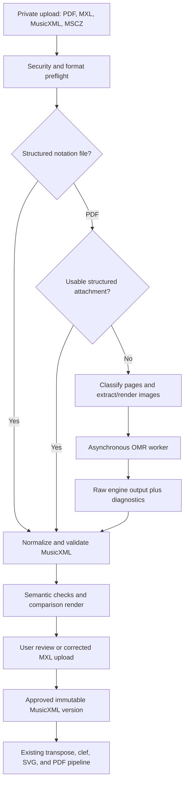

# PDF sheet music import feasibility

Research date: 2026-07-22

## Decision

Proceed with a scoped technical spike, then a private beta if the spike meets the
acceptance criteria below.

The feature is feasible for printed Common Western Music Notation when it is
presented as an assisted import with review. It is not currently feasible to
promise "upload any score PDF and get a trustworthy transcription" without user
verification.

The recommended product boundary is:

- Lossless or near-lossless import for MusicXML, compressed MusicXML, and other
  structured notation files.
- A fast path for a structured score embedded in a PDF, when one exists.
- Optical music recognition (OMR) for ordinary vector PDFs and image-only scans.
- Mandatory review before an OMR result becomes the canonical score used for
  transposition.
- Printed notation first. Handwriting, tablature, percussion, early notation,
  and dense orchestral manuscripts should initially be unsupported or clearly
  experimental.

The existing application is a good fit for this design. MusicXML is already the
canonical representation, while SVG and PDF are derived artifacts
([README](../README.md)). The reusable seam is:

`uploaded document -> import/OMR -> reviewed MusicXML -> existing transforms -> SVG/PDF`

## Why PDF type helps less than it first appears

A PDF can contain text, vector drawing commands, bitmap images, fonts,
attachments, and metadata. Those objects describe how a page looks. They do not
normally identify a glyph as "F-sharp quarter note in voice 2, measure 17."

PDF/A-3 and PDF 2.0 can carry arbitrary associated or embedded files, so it is
worth checking for `.musicxml`, `.mxl`, `.mscz`, `.mei`, `.abc`, or `.ly`
attachments before doing any recognition
([PDF Association: files inside PDF](https://pdfa.org/files-inside-pdf/),
[PDF/A-3 overview](https://pdfa.org/resource/iso-19005-3-pdf-a-3/)). This is a
real fast path, but it is not common enough to be the main plan.

Local inspection showed three distinct cases:

| Example | PDF internals | Consequence |
| --- | --- | --- |
| [A current Transposify output](../output/pdf/o-thousand-satb-d/score.pdf) | One vector page, no raster images, two text fonts, no attached files. The musical SVG has become vector drawing content. | Even a PDF created by this application cannot be round-tripped semantically today. |
| [Mutopia Aguado engraving](https://www.mutopiaproject.org/ftp/AguadoD/O11/aguado-op11n10/aguado-op11n10-let.pdf) | Two vector pages generated by LilyPond, eight embedded fonts including Emmentaler music fonts, no raster images or attachments. Text extraction returns titles and many meaningless music-font characters. | Vector geometry is crisp, but reconstructing notes from font codes, lines, paths, and positions would be renderer-specific OMR. |
| [1921 April Showers scan](https://commons.wikimedia.org/wiki/File:April_Showers.pdf) | Four pages, each a single JPEG of about 580 by 768 pixels, no fonts, text, or attachments. | There is no alternative to image recognition, and the source resolution limits accuracy. |

The practical conclusion is to classify PDFs but normalize both vector and
raster cases into the same OMR path. Vector pages should be rasterized sharply
at a controlled resolution. Image-only PDFs should use their original image
stream when that avoids resampling, then be deskewed, cropped, denoised, and
dewarped as needed.

Building a general vector-PDF-to-MusicXML parser is not recommended for the
MVP. Music PDFs vary by notation program, font, glyph encoding, SVG conversion,
and export settings. The engineering cost would buy a brittle second OMR engine
rather than a semantic fast path.

One low-cost improvement is under Transposify's control: future exported PDFs
can embed the approved `.mxl` source and a score/version hash. A later upload of
one of those PDFs would then round-trip losslessly.

## Current application fit and required generalization

The hard part is recognition and review, not the final rendering:

- `catalog/scores` already stores canonical MusicXML.
- The existing `music21` pipeline parses, transposes, selects lines, changes
  clefs, writes MusicXML, engraves with Verovio, and makes PDFs
  ([render core](../spikes/render/hymn_render/core.py)).
- The render service already accepts a trusted score path through a narrow
  adapter ([renderer](../services/render/render_service/renderer.py)).
- Existing validation checks XML shape, parts, measures, note payloads, and
  durations
  ([validator](../spikes/ingest/hymn_ingest/musicxml_validation.py)).

The surrounding product is still hymn-specific:

- Score identity is a fixed, hash-checked catalog entry rather than a
  user-owned asset.
- The API accepts static hymn IDs only.
- Individual-line extraction assumes exactly four positional S/A/T/B voices.
- Available targets are major keys only.
- A clef override is applied broadly in ways that are not safe for piano,
  orchestra, mixed ensembles, or mid-piece clef changes.
- Current cleanup strips instrument/part names that classical scores need.
- There is no asynchronous job model, upload storage, import version,
  recognizer diagnostics, correction state, or retention policy.

User scores should therefore use a separate model such as `user_scores`,
`score_sources`, `import_jobs`, and `score_versions`. The fixed public catalog's
provenance and SATB invariants should not be weakened to make room for private
uploads.

An OMR result must preserve more than valid XML. At minimum it needs accurate
pitch spelling, octave, accidentals, rhythm/divisions, rests, measures, ties,
tuplets, voices, staves, parts, clefs, key/time changes, transposing-instrument
information, and repeats. Lyrics and syllabification matter for vocal music.
A structurally valid score can still be musically wrong.

That distinction already appeared in the ABC work: all 293 files were
structurally valid, but 291 required cleanup or review
([phase 0 report](phase-0-report.md)). OMR will make this gap larger.

## Recommended import architecture

### 1. Upload and preflight

- Accept structured notation directly before mentioning PDF conversion.
- Verify magic bytes, MIME type, encryption, page count, dimensions, file size,
  attachment count, and decompression limits.
- Reject password-protected files, active content, malformed object graphs,
  excessive pages, and unsupported notation classes.
- Store by generated object ID and content hash. Never use the user's filename
  as a filesystem path.
- Keep uploads private and process them in a sandbox with CPU, memory, time,
  output-size, and network limits.

### 2. PDF fast paths and page preparation

- Inspect associated and embedded files first.
- Classify pages as vector, image-only, or mixed using image coverage, drawing
  content, and fonts.
- For vector pages, rasterize consistently, initially testing 300 and 400 DPI.
- For raster pages, extract original images when possible. Do not upscale and
  present the result as added detail.
- Apply rotation, crop, grayscale/binarization, deskew, denoise, and dewarp as
  measurable preprocessing variants rather than permanent assumptions.

### 3. Recognition

- Run OMR as an asynchronous, versioned job outside the request/response render
  path.
- Preserve the source hash, page images, engine name/version/configuration, raw
  engine project, raw MusicXML, logs, timings, and confidence/region data.
- Make recognition idempotent by source hash plus engine/configuration version.
- Keep the OMR worker separate from the existing renderer. OMR dependencies,
  runtimes, and multi-minute workloads have a very different operational
  profile.

### 4. Normalization and validation

- Convert compressed MusicXML to a canonical, deterministic `score-partwise`
  representation.
- Validate against MusicXML plus the application's stricter semantic contract.
- Check measure arithmetic, voices, part/staff topology, clefs, keys, meters,
  ties, tuplets, accidentals, and note/rest payloads.
- Render the recognized result with Verovio next to the source page.
- Generate an error/attention report at page, system, measure, and part level.
- Treat recognizer confidence as a prioritization signal, not proof of
  correctness, until it is calibrated on the application's corpus.

### 5. Review

The first useful review experience does not need to be a full notation editor:

- Show the original page and the re-engraved result side by side.
- Let the user play the recognized score and solo detected parts.
- Highlight structural warnings and low-confidence regions.
- Let the user download MusicXML, correct it in MuseScore or another editor,
  and upload the corrected version.
- Require an explicit approval before enabling transposition.

A later in-app editor can add pitch, duration, accidental, voice, measure,
part-name, and staff corrections. A correction surface is a large product in
its own right and should not block the recognition benchmark.

## OMR options

No public accuracy percentage should be trusted across arbitrary music. Score
texture, engraving, scan quality, and the definition of "correct" change the
answer. The choice should be made with the application benchmark below.

| Candidate | Strengths | Constraints and product risk | Recommendation |
| --- | --- | --- | --- |
| [Flat/Tutteo OMR API](https://flat.io/developers/docs/api/omr/) | Hosted REST API built for PDF/photo to MusicXML; asynchronous job lifecycle; progress, page credits, optional instrument/title review, direct MusicXML/MXL export, and no requirement to add the result to a Flat library. | Proprietary hosted service; public beta with possible breaking changes; no public numerical accuracy benchmark; private scores leave Transposify's infrastructure. | Fastest credible hosted MVP candidate. Negotiate volume pricing, DPA, retention/deletion, training-use opt-out, region/security, and SLA. |
| [ReadScoreLib](https://www.playscore.co/wp-content/uploads/2016/05/ReadScoreLib-description.pdf) | Licensable local/OEM library behind PlayScore; multi-page image to MusicXML/MIDI; Windows, macOS, iOS, and Android; can expose object IDs and source-page bounding boxes for correction UI. | Proprietary SDK with negotiated platform/features/pricing; no public reproducible accuracy benchmark; PDF pages must be supplied as images. | Strongest local commercial lead. Request an evaluation SDK and server/container terms. |
| [Audiveris](https://audiveris.github.io/audiveris/_pages/handbook/) | Mature printed-score application; PDF/image input; batch CLI; editable native `.omr` project; MusicXML export; current releases; designed for human correction. | Printed Common Western notation only; documentation says accuracy remains far from perfect; Java service; AGPL-3.0. | Primary open-source baseline. Keep it behind a versioned worker boundary and obtain open-source license review before product integration. |
| [homr](https://github.com/liebharc/homr) | Active Python project; image to MusicXML; CPU or optional CUDA; models camera distortion and staff grouping. | AGPL-3.0; image-oriented multi-page assembly; its own README says the current scope emphasizes pitch/rhythm and omits or limits several symbols. | Strong challenger, especially for phone-like or distorted input. |
| [oemer](https://github.com/BreezeWhite/oemer) | MIT; ONNX/TensorFlow; image to MusicXML; skew/dewarp support. | The project points users to homr as its improved successor; its documented GPU runtime is about 3-5 minutes per image; printed Western notation only. | Useful permissive baseline, but not the leading default. |
| [Clarity-OMR](https://github.com/clquwu/Clarity-OMR) | Direct PDF to MusicXML; 300-DPI rendering; GPU or slower CPU; note-level comparison utility. | Very new, few commits, no release, GPL-3.0, model weights downloaded separately. Operational maturity and weight/data terms need review. | Experimental challenger only. |
| PlayScore 2, ScanScore, SmartScore, Soundslice | Existing correction-oriented end-user products demonstrate demand and useful workflows. PlayScore, ScanScore, and SmartScore export MusicXML. Soundslice supports scan, edit, playback, and export. | Mostly desktop/mobile or hosted products rather than embeddable OMR APIs. Soundslice explicitly says its PDF/image scanner is not available through its data API. Commercial terms and data handling require direct negotiation. | Ask vendors about OEM/private API licensing, but do not make the MVP depend on an undocumented integration. |

Audiveris supports a headless batch CLI that can transcribe and export MusicXML
([CLI documentation](https://audiveris.github.io/audiveris/_pages/guides/advanced/cli/)).
Its handbook explicitly excludes handwriting and emphasizes manual correction
([handbook](https://audiveris.github.io/audiveris/_pages/handbook/)). The current
GitHub release listed during this research was 5.10.2, dated 2026-03-27
([releases](https://github.com/Audiveris/audiveris/releases)).

Flat's API is unusually close to the proposed product workflow: it is
asynchronous, can pause to review instrument detection, and can return MusicXML
without creating a hosted library score
([job documentation](https://flat.io/developers/docs/api/omr/jobs)). It is still
a beta. A proof of concept should not be mistaken for acceptable private-content
terms until those are negotiated.

ReadScoreLib is a licensable binary library rather than a consumer-app
automation path. Its optional mapping from recognized MusicXML objects to page
bounding boxes could substantially reduce the cost of building source-versus-
recognition correction UI
([SDK description](https://www.playscore.co/wp-content/uploads/2016/05/ReadScoreLib-description.pdf),
[MusicXML software directory](https://www.musicxml.com/software/)).

Audiveris and homr are AGPL-3.0; Clarity is GPL-3.0; oemer is MIT. This table is
an engineering screen, not a license opinion. Before launch, counsel should
review the precise process boundary, modifications, source-offer obligations,
model weights, bundled dependencies, and any training-data conditions.

## Evidence from current OMR research

OMR has improved, but complex scores and domain shift remain material:

- The 2024 OLiMPiC work distinguishes visual "reprintability" from musical
  "replayability" and argues that correction effort is the practical endpoint.
  Its pianoform model's full MusicXML tree-edit error was 13.7% on synthetic
  images, 44.4% on real scans without scan-like augmentation, and 18.4% on real
  scans with augmentation. These are research results on a defined dataset, not
  expected Transposify accuracy
  ([paper](https://arxiv.org/pdf/2403.13763)).
- The 2025-2026 Sheet Music Benchmark contains 685 pages and 4,039 annotated
  regions across monophony, pianoform, quartet, and other textures. Its authors
  still describe full-page transcription and standardized evaluation as open
  challenges
  ([paper](https://arxiv.org/pdf/2506.10488)).
- A 2026 independent full-page test on difficult historical piano scans found
  high symbol error rates across commercial and open-source tools. Soundslice
  was best among the tested ready-made products at 34.5% SER on the cleaner
  Mozarteum set and 54.9% on Polish scans. Audiveris measured 94.6% and 94.9%;
  oemer measured 90.3% and 75.2%. The paper also counted failed imports as full
  re-entry work. These results are domain- and version-specific, but they are
  strong evidence against an unreviewed automatic workflow
  ([paper](https://link.springer.com/article/10.1007/s11263-025-02654-6),
  [Table 6](https://link.springer.com/article/10.1007/s11263-025-02654-6/tables/6)).
- MusicXML remains the right application boundary. It is a W3C community
  specification with score-partwise and score-timewise forms, and compressed
  MusicXML is standardized as a ZIP container
  ([MusicXML 4.0](https://www.w3.org/2021/06/musicxml40/)).

The implication is to buy accuracy with scope, preprocessing, review, and
corpus-specific measurement before considering custom model training.

## Benchmark corpus

Use several tiers so a high score on synthetic clean pages cannot hide failure
on the PDFs users actually have.

### Paired datasets

1. [Muse OMR Benchmark](https://github.com/musescore/omr_benchmark): 1,077
   CC0 PDF/MuseScore pairs with ink blobs, scratches, paper texture, rotation,
   and related controlled degradation. This is the best ready-made broad
   regression suite, but its damage is simulated.
2. [OLiMPiC](https://github.com/ufal/olimpic-icdar24): exact MusicXML-derived
   data with about 2,900 real scanned piano-system samples in its development
   and test partitions, plus synthetic training data. It is CC BY-SA 4.0 and
   system-cropped rather than a complete upload workflow.
3. [OpenScore Lieder](https://github.com/OpenScore/Lieder): more than 1,200
   CC0 voice-and-piano scores. These can produce exact clean renders and
   controlled degraded variants.

### Small document-level seed set

| Score | Purpose | Rights/source |
| --- | --- | --- |
| [Bach Invention 2, BWV 773](https://www.mutopiaproject.org/cgibin/piece-info.cgi?id=58) | Clean two-staff keyboard baseline | Mutopia, Public Domain, PDF plus LilyPond |
| [Bach Cello Suite 4, BWV 1010](https://www.mutopiaproject.org/cgibin/piece-info.cgi?id=518) | Solo bass clef, dense beaming and chords | Mutopia, Public Domain, PDF plus LilyPond |
| [Sor Op. 45 No. 1](https://www.mutopiaproject.org/cgibin/piece-info.cgi?id=2109) | Guitar voices and fingering | Mutopia, CC BY-SA 4.0, PDF plus LilyPond |
| [Handel Hallelujah Chorus](https://www.mutopiaproject.org/cgibin/piece-info.cgi?id=459) | SATB lyrics plus orchestra stress case | Mutopia, Public Domain, PDF and source bundles |
| [Mozart Eine kleine Nachtmusik, movement 1](https://www.mutopiaproject.org/cgibin/piece-info.cgi?id=900) | Quartet score, parts, alto and bass clefs | Mutopia, Public Domain, PDF and source bundles |
| [Bach BWV 1001 Adagio](https://www.mutopiaproject.org/ftp/BachJS/BWV1001/bwv-1001_1/bwv-1001_1-a4.pdf) and [autograph](https://commons.wikimedia.org/wiki/File:BWV1001_adagio_autograph_manuscript_1720.jpeg) | Same-work clean vector versus handwriting domain shift | Vector CC BY-SA 3.0; autograph Public Domain Mark |
| [Arriaga Military March](https://commons.wikimedia.org/wiki/File:Military_March_(IA_imslp-march-arriaga-juan-crisstomo-de).pdf) | Ten-page historical military-band scan | Public Domain Mark; no symbolic ground truth |
| [America, My Country 'Tis of Thee, 1878](https://www.loc.gov/item/2023831586/) | Ordinary historical library scan | Library of Congress collection is public domain and free to use/reuse |

Mutopia's catalog supplies PDFs plus exact LilyPond source and states that its
music is Public Domain or under a listed Creative Commons license
([Mutopia](https://www.mutopiaproject.org/),
[license details](https://www.mutopiaproject.org/legal.html)). Record rights
for the composition, edition/typesetting, scan, and hosting terms separately.
Do not infer that one public-domain label covers every layer.

### Metrics

Report metrics separately for:

- note pitch and accidental;
- onset, duration, dot, tie, tuplet, and rest;
- measure count and duration arithmetic;
- voice assignment and ordering;
- staff, part, group, and transposing-instrument identity;
- clef, key, meter, tempo, and changes;
- lyrics and text;
- unsupported symbols;
- valid MusicXML and successful `music21`/Verovio parsing;
- wall time, peak CPU/RAM/GPU, artifact size, and per-page cost;
- human correction minutes per page and per measure.

Use MuseScore's benchmark metric groups and OMR-NED/TED-style reports, but make
human correction time the decisive product metric. A single edit-distance or
note F1 score can hide a wrong clef or key signature that corrupts an entire
passage.

## Spike plan and exit criteria

### Step 0: direct structured upload

Prove private score identity, storage, validation, versioning, authorization,
rendering, deletion, and direct `.musicxml`/`.mxl` upload first. This work is
needed regardless of OMR and gives users with source files the best result.

### Step 1: engine and vendor benchmark

Run Flat/Tutteo, an evaluation build of ReadScoreLib, and Audiveris over
roughly 100-300 pages. Add homr or oemer as an experimental/permissive
comparator if time permits. Use:

- 40-60 stratified Muse benchmark documents;
- 100 OLiMPiC real scan systems and 50 synthetic systems;
- the clean document-level seed set;
- the three domain-shift scans;
- several representative user-provided PDFs, only with explicit permission.

Freeze every input hash, engine version, model hash, preprocessing option, and
output. Do not train on private uploads.

### Step 2: private beta

Initially support:

- printed, modern Western notation;
- one to four staves per system;
- solo, piano, voice/piano, SATB, and string-quartet-like textures;
- reasonably straight scans and born-digital PDFs;
- a conservative page cap.

Route dense orchestral pages and handwriting to "unsupported/experimental"
rather than silently returning a plausible but wrong score.

Advance from spike to beta only if:

- at least 95% of in-scope documents complete without a crash or unusable file;
- every accepted result parses through MusicXML, `music21`, and Verovio;
- median correction time is less than 25% of manual re-entry time for the same
  material;
- review catches all intentionally seeded high-impact errors such as wrong
  clef, key, meter, part grouping, and missing measures;
- latency, resource use, and per-page cost fit an explicit product budget; and
- the OMR license and user-content policy receive legal approval.

Do not create an automatic "ready" confidence threshold until confidence is
calibrated against this corpus. The first beta can require approval for every
OMR import.

## Product and legal guardrails

Owning a physical score or purchasing a PDF does not by itself transfer the
copyright in the work. U.S. law explicitly separates ownership of a material
copy from copyright ownership
([17 USC 202](https://www.copyright.gov/title17/92chap2.html)), and copyright
owners hold reproduction and derivative-work rights
([Copyright Office overview](https://www.copyright.gov/what-is-copyright/)).
Personal use or fair use may apply in some situations, but it is not automatic.
This section is product risk framing, not legal advice.

Before launch:

- Require the user to affirm that they own the copyright, have permission, or
  otherwise have a lawful basis to upload and transform the score.
- Keep uploads and derived scores private by default. Do not make them
  searchable, shareable, or part of the public catalog.
- Do not use uploads for training or evaluation without a separate,
  affirmative license.
- Publish clear retention and deletion behavior. Prefer short retention for the
  source PDF when the user does not opt to keep it.
- Encrypt storage and transport, use short-lived URLs, isolate jobs by owner,
  and record access/deletion events.
- Establish takedown, repeat-infringer, and account-termination procedures.
  U.S. service providers seeking DMCA safe-harbor protection must meet
  conditions including a designated agent and notice/takedown process
  ([Copyright Office section 512 resources](https://www.copyright.gov/512/index.html),
  [agent directory guidance](https://www.copyright.gov/dmca-directory/)).
- Have counsel review terms, privacy, jurisdiction, OMR licenses, and whether
  generated transpositions are permitted for the intended customer segments.

Public catalog expansion remains a separate rights workflow. A private upload
must never be promoted into the catalog merely because recognition succeeded.

## Rough delivery shape

For one experienced engineer, directional rather than committed estimates are:

- Direct structured upload and private score versioning: 1-2 weeks.
- Reproducible 100-300-page OMR benchmark and decision: 2-4 weeks.
- Asynchronous import, one recognizer, validation, comparison preview, and
  corrected-MusicXML re-upload: 4-8 additional weeks.
- A polished in-browser correction editor, broad notation coverage, calibrated
  confidence, and production operations: a separate multi-month track.

The fastest credible route is not to build a new recognition model. It is to
make structured upload excellent, benchmark existing OMR engines on the actual
target corpus, launch a narrowly labeled reviewed beta, and expand only where
measured correction time proves user value.
